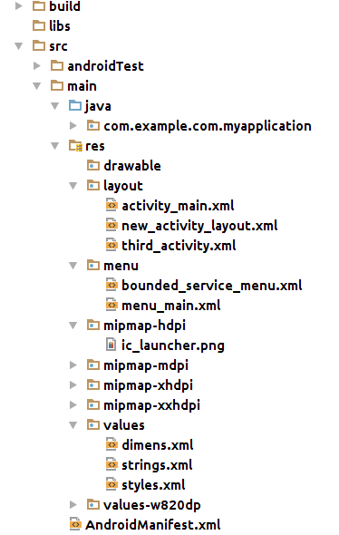

Android Main Building Blocks
------

Android  system was made with the goal  to make an operating system which runs on many many different devices.

An android app consist of xml and java where an xml is mostly like a helper to set the layout,and store the strings in saperate xml file but the main xml in Android is menifest.xml which holds the permissions which are needed by App and declaration information of main building blocks

In Android Java gets compiled into .class files which are parsed and converted into .dex (Dalvik Executable Code) which gets combined with xml and forms .apk file.This .apk file runs into Dalvik
Virtual Machine.

**Note: Google Introduced Dalvik because of 2 reasons**

1.DVM is more efficient in terms of saving the battery
2.There will be no cost of licencing the DVM which was there when we hve to use JVM.

Following is the basic structure of Android App

The image is explained below

src->main->java->There is a source code.

Src->main->res->Contains all xml resources.

Src->main->res->layout->The xmls in this folder is used to make the layout of the screen .

Src->main->res->menu->Folder contains the optional menu of Android Activity.

Src->main->res->mipmap*->Contains the icon of the App.

Src->main->res->values->string.xml->Contains the String Constants of the application.

Src->main->res->values->dimens.xml->Contains the dimention for the activity

Src->main->res->AndroidMenifest.xml->This xml holds the permissions and list of all the main building blocks

Now coming to the  main building blocks of Android system

*Activity*

Can be reffered to as a screen in the operating system.

*Service*

This is used to run the background task .They mostly run in main thread however there are special type of services which run in different thread.

*BroadCast Receivers*

These are the receivers which receive on different events i.e they can act like a callback to different events e.g system starting up

*Application Objects*

This is the main object which holds the application level values .

*Content Providers*

These are the building blocks which are used to share the data between the Apps e.g list of songs gets shared between the VLC player and Android default music player.This is possible because of Content Providers only

All the main building blocks have some specified methods which are run by the Android system and  all the building blocks have to be listed in AndroidManifest.xml

Internally android system uses Observer pattern

Some more concepts in Android is explained below

*Intent*

Intent are objects which acts as a glue between different components.Through intent we can pass the control from one compoment to another

Now here is the detailed discription of the main building blocks

* [Activity](./activity.md)
* [Service](./service.md)
