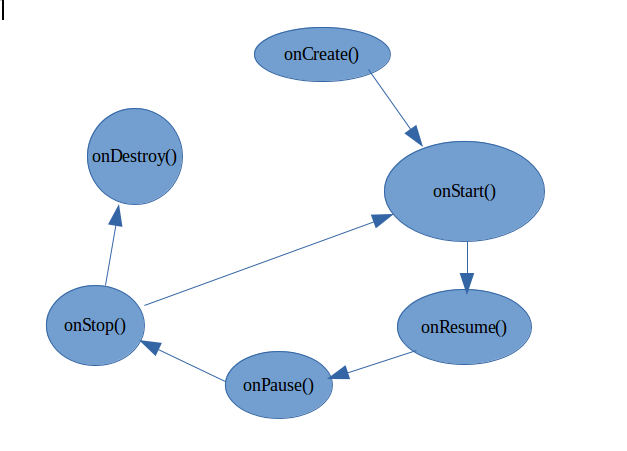
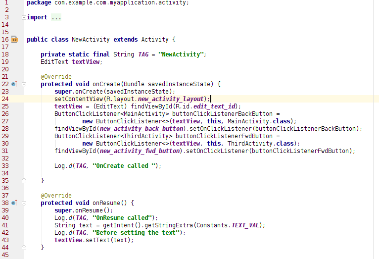

Activity
------
This is conceded as a screen in Android world which have some specified methods which are run by the android system.

Main methods of an activity are

void onCreate(Bundle savedInstanceState)

This method is called once in the lifecycle of an activity which is the initialization method.

In it's arguements Bundle is passed .This thing is used when we rotate the screen and layout is changed from landscape to potrait or from potrait to landscape.

**void onResume()**

onResume is called  whenever the Activity is resumed after initialization.

The main difference between onCreate and onResume is  that onCreate is used for initialization and  onResume is called whenever Activity is resumed where resuming is done after initialization or after going to some other activity and then coming back.

e.g suppose we  initialize one  Activity then we initialize another now if we call the same activity again then onResume will be called

another example is

We call one activity then press the home key and again we call that activity then onResume will be called.

**void onStart()**

This is called just before onResume.For doing anything which needs to be done before onResume and not in onCreate.

**void onStop()**

This method is called whenever a we are moving form the current activity.Whether it is after pressing the home key or we move from one activity to another via a App itself.

**void onPause()**

This is called just before the onStop method.

onDestroy()

This method is used to free the memory .
This is called when we press the back button and doing so close the App.

Following is the example of a  simple activity

The above code is explained as below

*24 setContentView(R.layout.new_activity_layout);*
The above line is the main line which sets the layout of the Activity and link it to the activity basically this line sets the contents from xml to code

*25 textView = (EditText) findViewById(R.id.edit_text_id);*
The above line is used to get any view component's reference in the code  

*From line 26 to 28 we are initalizing a button onClick listener and setting it*
26 ButtonClickListener<MainActivity> buttonClickListenerBackButton =
        new ButtonClickListener<>(textView, this, MainActivity.class);
28 findViewById(new_activity_back_button).setOnClickListener (buttonClickListenerBackButton);

 *41 String text = getIntent().getStringExtra(Constants.TEXT_VAL);*

 In above line getIntent() method gets the intent which calls the Activity.Through getStringExtra we get the value which is passed through intent
