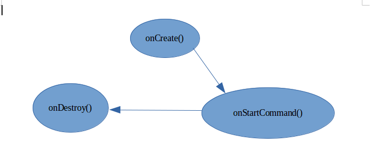

Service
------

Services are the building blocks that are used for running the background tasks.
e.g When we want to run the music in a background .

Please note that the task that service runs are run in the main thread.

Following are the main methods of service

**void onCreate()**  

Called when it is called for the first time

**onStartCommand()**

Called when the service is started everytime.

**onDestroy()**

Called when the service is terminated.

**onBind()**

Called when binded service is used will discuss it later.





```java
package com.example.com.myapplication.service;
import android.app.Service;
import android.content.Intent;
import android.os.IBinder;
import android.support.annotation.Nullable;
import android.util.Log;
public class FirstService extends Service {
    private static final String TAG="FirstService";
    @Nullable
    @Override
    public IBinder onBind(Intent intent) {
        return null;
    }
    @Override
    public void onCreate() {
        super.onCreate();
        Log.d(TAG,"On create called");
    }
    @Override
    public int onStartCommand(Intent intent, int flags, int startId) {
        Log.d(TAG,"On startCommand called");
        return super.onStartCommand(intent, flags, startId);
    }
    @Override
    public void onDestroy() {
        super.onDestroy();
        Log.d(TAG, "On Destroy called");
    }
}
```

Note that to start the service we need to call the startService(Intent intent) method and to stop the service we need to call stopService(Intent intent) method .


There are other type of service also one of which is IntentService

IntentService is used to run the task in a differrnt thread where starting and stoping of thread is managed by the android system only.

There basically used for long running operations which are not good to run on the main thread.

The main method which you need to write for the *IntentService* is
```java
void onHandleIntent(Intent intent){

}
```
